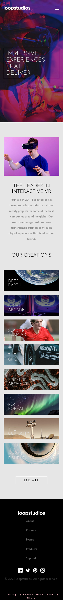

# Frontend Mentor - Loopstudios landing page solution

This is a solution to the [Loopstudios landing page challenge on Frontend Mentor](https://www.frontendmentor.io/challenges/loopstudios-landing-page-N88J5Onjw). Frontend Mentor challenges help you improve your coding skills by building realistic projects. 

## Table of contents

- [Overview](#overview)
  - [The challenge](#the-challenge)
  - [Screenshot](#screenshot)
  - [Links](#links)
- [My process](#my-process)
  - [Built with](#built-with)
  - [What I learned](#what-i-learned)
  - [Continued development](#continued-development)
  - [Useful resources](#useful-resources)
- [Author](#author)

## Overview

### The challenge

Users should be able to:

- View the optimal layout for the site depending on their device's screen size
- See hover states for all interactive elements on the page

### Live Demo
[See finished work here](https://loopstudios-landing-page-drab-delta.vercel.app/)
  

### Screenshot
  - [Laptop View](#laptop-view)
  - [Mobile View](#mobile-view)

####  Laptop View

####  Mobile View

### Links
- Live Site URL: [https://loopstudios-landing-page-drab-delta.vercel.app/](https://loopstudios-landing-page-drab-delta.vercel.app/)
- Github repo URL: [https://github.com/MikeyOnyedika/loopstudios-landing-page](https://github.com/MikeyOnyedika/loopstudios-landing-page)

 

## My process

### Built with

- Semantic HTML5 markup
- Tailwindcss
- Flexbox
- CSS Grid
- Mobile-first workflow
- [React](https://reactjs.org/) - JS library
- Vite

### What I learned
- Got some more practice with css grid

### Continued development
- Probably would be working on more animation related projects so I have an excuse to learn GSAP and get more hands on practice using the native css animation API

### Useful resources
- [StackOverflow!](https://stackoverflow.com)
- [Tailwindcss official docs](https://tailwindcss.com)

## Author
- Github - [MikeyOnyedika](https://github.com/MikeyOnyedika)
- Twitter  - [Mikey24820494](https://www.twitter.com/Mikey24820494)
- Frontend Mentor - [@MikeyOnyedika](https://www.frontendmentor.io/profile/MikeyOnyedika)
